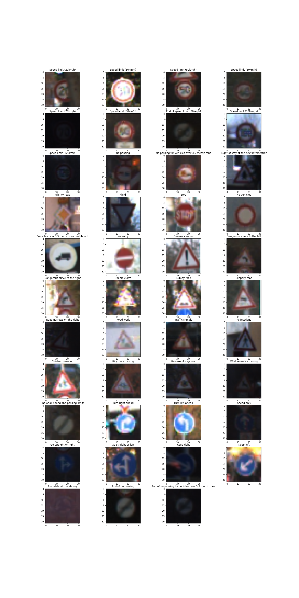
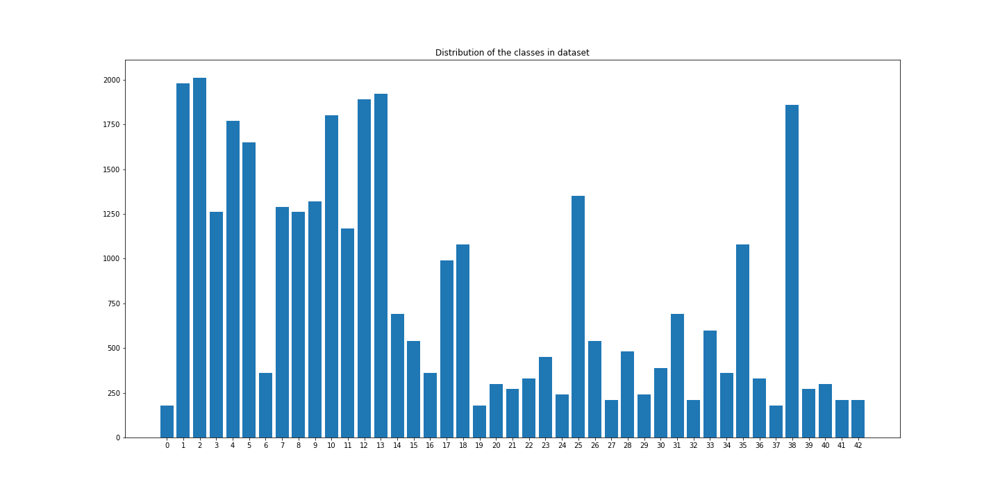

## Project: Build a Traffic Sign Recognition Program
[](http://www.udacity.com/drive)

Overview
---

Aim of the project is to create convolutional neural network for traffic signs classification. Target accuracy of the net on the validation part of the dataset is > 93%.


Dataset summary
---
In this project [German Traffic Sign Dataset](http://benchmark.ini.rub.de/?section=gtsrb&subsection=dataset) is used. This dataset consit of the 32x32 pix color images of the sings of the 43 classes. Trainig part consists of the 347999 images, valuation part - 4410 images, test - 12630 images. Image data shape = (32, 32, 3).

Here is the example of each class.


Images in dataset are very low resolution and poor contrast. It is very challenging for me to recognize signs on some of the images. Also dataset is very unbalanced.

Here is the image of the classes distribution.



Design and Test a Model Architecture
---

In **preprocessing** the images I use only normalization. I also try to apply Contrast Limited Adaptive Histogram Equalization (CLAHE) method but it didn't work for me. If I used it in my code network immidiately stops learning, speed of learning procces significantly reduse and validation loss almost didn't change.

I started searching ideal **model architecture** from the  standart LeNet. 

| layer | output |
|-------|--------|
| 5x5 convolution stride 1 valid padding relu activation| 28x28x6|
| 2x2 max pooling strine 2 valid padding | 14x14x6 |
| 5x5 convolution stride 1 valid padding relu activation| 10x10x16|
| 2x2 max pooling strine 2 valid padding | 5x5x16 |
| flatten | 400 |
| fully connected relu activation | 120 |
| fully connected relu activation | 84 |
| fully connected softmax activation | 43 |

It  has 0.9413 validation accuracy with hyperparameters batch size 64 epoch 30 lerning rate 0.001 and I started to improve it. 
Here is the table of the model architecture which I try and their hyperparameters.

|  model description | batch size | n epoch | learn rate | validation accuracy |
|--------------------|------------|---------|------------|---------------------|
|standart LeNet, relu activation all layers, output softmax activation, batch normalization all layers   | 64          | 30 | 0.001 | 0.9413 |
|standart LeNet, relu activation all layers, output softmax activation, batch normalization all layers, l2 regularization all layers | 64 | 30 | 0.001 | 0.8785 |
|standart LeNet, relu activation all layers, output softmax activation, batch normalization all layers, l2 regularization all layers | 64 | 40 | 0.001 | 0.8587 |
|standart LeNet, relu activation all layers, output softmax activation, batch normalization all layers, l2 regularization fully connected layers | 64 | 40 | 0.001 | 0.8803 |
|standart LeNet, relu activation all layers, output softmax activation, batch normalization all layers, l2 regularization fully connected layers | 64 | 40 | 0.001 | 0.9249 |
|standart LeNet, relu activation all layers, output softmax activation, batch normalization all layers, l2 regularization fully connected layers | 200 | 30 | 0.001 | 0.9363 |
|standart LeNet, relu activation all layers, output softmax activation , batch normalization all layers, weighted classes | 64 | 30 | 0.001 | 0.9320 |
|LeNet, first conv layer depth 12, second conv layer depth 32, relu activation all layers, output softmax activation, batch normalization all layers, weighted classes | 64 | 30 |0.001|0.9669|
|LeNet, first conv layer depth 12, second conv layer depth 32, relu activation all layers, output softmax activation, batch normalization all layers, weighted classes| 64 | 29 | 0.001 |0.9728|
|LeNet, first conv layer depth 12, second conv layer depth 32, relu activation all layers, output softmax activation, batch normalization all layers, weighted classes| 64 | 29 | 0.002 |0.9766|

 **Final Model Architecture**
 
| layer | output |
|-------|--------|
| 1x1 convolution stride 1 valid padding relu activation| 28x28x3|
| 5x5 convolution stride 1 valid padding relu activation| 28x28x12|
| 2x2 max pooling strine 2 valid padding | 14x14x12 |
| 5x5 convolution stride 1 valid padding relu activation| 10x10x32|
| 2x2 max pooling strine 2 valid padding | 5x5x32|
| flatten | 400 |
| fully connected relu activation | 120 |
| fully connected relu activation | 84 |
| fully connected softmax activation | 43 |

| types of data augmentation | boundaries |
|---|---|
| rotation | 10 deg|
| zoom range | 0.15|
| width and height shift | 0.1 |
| shear range | 0.15 |

Final **model was trained** for 29 epoch with Adam optimizer, inintial learning rate 0.002, decay is init LR / (NUM_EPOCHS * 0.5)  

**solution approach**


Test a Model on New Images
---

examples of **New images**

performance on new images


model certainty Softmax Probabilities

In this project, you will use what you've learned about deep neural networks and convolutional neural networks to classify traffic signs. You will train and validate a model so it can classify traffic sign images using the [German Traffic Sign Dataset](http://benchmark.ini.rub.de/?section=gtsrb&subsection=dataset). After the model is trained, you will then try out your model on images of German traffic signs that you find on the web.

We have included an Ipython notebook that contains further instructions 
and starter code. Be sure to download the [Ipython notebook](https://github.com/udacity/CarND-Traffic-Sign-Classifier-Project/blob/master/Traffic_Sign_Classifier.ipynb). 

We also want you to create a detailed writeup of the project. Check out the [writeup template](https://github.com/udacity/CarND-Traffic-Sign-Classifier-Project/blob/master/writeup_template.md) for this project and use it as a starting point for creating your own writeup. The writeup can be either a markdown file or a pdf document.

To meet specifications, the project will require submitting three files: 
* the Ipython notebook with the code
* the code exported as an html file
* a writeup report either as a markdown or pdf file 

Creating a Great Writeup
---
A great writeup should include the [rubric points](https://review.udacity.com/#!/rubrics/481/view) as well as your description of how you addressed each point.  You should include a detailed description of the code used in each step (with line-number references and code snippets where necessary), and links to other supporting documents or external references.  You should include images in your writeup to demonstrate how your code works with examples.  

All that said, please be concise!  We're not looking for you to write a book here, just a brief description of how you passed each rubric point, and references to the relevant code :). 

You're not required to use markdown for your writeup.  If you use another method please just submit a pdf of your writeup.

The Project
---
The goals / steps of this project are the following:
* Load the data set
* Explore, summarize and visualize the data set
* Design, train and test a model architecture
* Use the model to make predictions on new images
* Analyze the softmax probabilities of the new images
* Summarize the results with a written report

### Dependencies
This lab requires:

* [CarND Term1 Starter Kit](https://github.com/udacity/CarND-Term1-Starter-Kit)

The lab environment can be created with CarND Term1 Starter Kit. Click [here](https://github.com/udacity/CarND-Term1-Starter-Kit/blob/master/README.md) for the details.

### Dataset and Repository

1. Download the data set. The classroom has a link to the data set in the "Project Instructions" content. This is a pickled dataset in which we've already resized the images to 32x32. It contains a training, validation and test set.
2. Clone the project, which contains the Ipython notebook and the writeup template.
```sh
git clone https://github.com/udacity/CarND-Traffic-Sign-Classifier-Project
cd CarND-Traffic-Sign-Classifier-Project
jupyter notebook Traffic_Sign_Classifier.ipynb
```

### Requirements for Submission
Follow the instructions in the `Traffic_Sign_Classifier.ipynb` notebook and write the project report using the writeup template as a guide, `writeup_template.md`. Submit the project code and writeup document.

## How to write a README
A well written README file can enhance your project and portfolio.  Develop your abilities to create professional README files by completing [this free course](https://www.udacity.com/course/writing-readmes--ud777).

