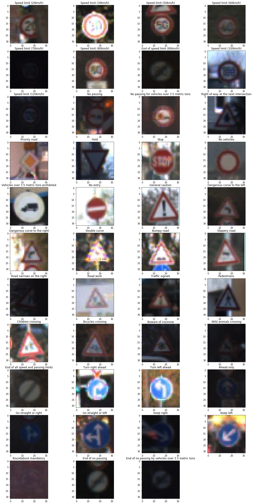
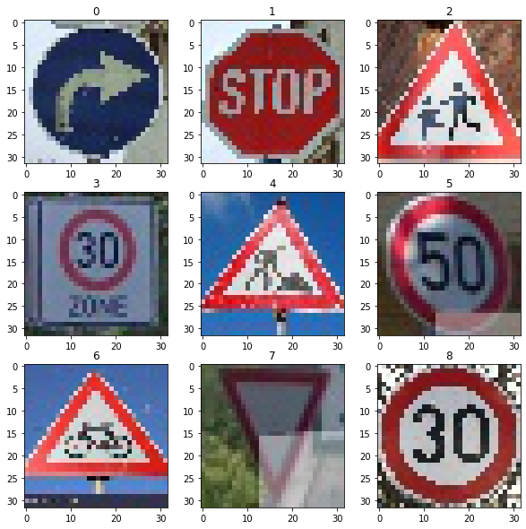

## Project: Build a Traffic Sign Recognition Program

Overview
---

Aim of the project is to create convolutional neural network for traffic signs classification. Target accuracy of the net on the validation part of the dataset is > 93%.

Dataset summary
---
In this project [German Traffic Sign Dataset](http://benchmark.ini.rub.de/?section=gtsrb&subsection=dataset) is used. This dataset consit of the 32x32 pix color images of the sings of the 43 classes. Trainig part consists of the 347999 images, valuation part - 4410 images, test - 12630 images. Image data shape = (32, 32, 3).

Here is the example of each class.

Images in dataset are very low resolution and poor contrast. It is very challenging for me to recognize signs on some of the images. Also dataset is very unbalanced.

Here is the image of the classes distribution.

Design and Test a Model Architecture
---

In **preprocessing** the images I use only normalization. I also try to apply Contrast Limited Adaptive Histogram Equalization (CLAHE) method but it didn't work for me. If I used it in my code network immidiately stops learning, speed of learning procces significantly reduse and validation loss almost didn't change.

I started searching ideal **model architecture** from the  standart LeNet. 

| layer | output |
|-------|--------|
| 5x5 convolution stride 1 valid padding relu activation| 28x28x6|
| 2x2 max pooling strine 2 valid padding | 14x14x6 |
| 5x5 convolution stride 1 valid padding relu activation| 10x10x16|
| 2x2 max pooling strine 2 valid padding | 5x5x16 |
| flatten | 400 |
| fully connected relu activation | 120 |
| fully connected relu activation | 84 |
| fully connected softmax activation | 43 |

It  has 0.9413 validation accuracy with hyperparameters batch size 64 epoch 30 lerning rate 0.001 and I started to improve it. 
Here is the table of the model architecture which I try and their hyperparameters.

|  model description | batch size | n epoch | learn rate | validation accuracy |
|--------------------|------------|---------|------------|---------------------|
|standart LeNet, relu activation all layers, output softmax activation, batch normalization all layers   | 64          | 30 | 0.001 | 0.9413 |
|standart LeNet, relu activation all layers, output softmax activation, batch normalization all layers, l2 regularization all layers | 64 | 30 | 0.001 | 0.8785 |
|standart LeNet, relu activation all layers, output softmax activation, batch normalization all layers, l2 regularization all layers | 64 | 40 | 0.001 | 0.8587 |
|standart LeNet, relu activation all layers, output softmax activation, batch normalization all layers, l2 regularization fully connected layers | 64 | 40 | 0.001 | 0.8803 |
|standart LeNet, relu activation all layers, output softmax activation, batch normalization all layers, l2 regularization fully connected layers | 64 | 40 | 0.001 | 0.9249 |
|standart LeNet, relu activation all layers, output softmax activation, batch normalization all layers, l2 regularization fully connected layers | 200 | 30 | 0.001 | 0.9363 |
|standart LeNet, relu activation all layers, output softmax activation , batch normalization all layers, weighted classes | 64 | 30 | 0.001 | 0.9320 |
|LeNet, first conv layer depth 12, second conv layer depth 32, relu activation all layers, output softmax activation, batch normalization all layers, weighted classes | 64 | 30 |0.001|0.9669|
|LeNet, first conv layer depth 12, second conv layer depth 32, relu activation all layers, output softmax activation, batch normalization all layers, weighted classes| 64 | 29 | 0.001 |0.9728|
|LeNet, first conv layer depth 12, second conv layer depth 32, relu activation all layers, output softmax activation, batch normalization all layers, weighted classes| 64 | 29 | 0.002 |0.9766|

 **Final Model Architecture**
 
| layer | output |
|-------|--------|
| 1x1 convolution stride 1 valid padding relu activation| 28x28x3|
| 5x5 convolution stride 1 valid padding relu activation| 28x28x12|
| 2x2 max pooling strine 2 valid padding | 14x14x12 |
| 5x5 convolution stride 1 valid padding relu activation| 10x10x32|
| 2x2 max pooling strine 2 valid padding | 5x5x32|
| flatten | 400 |
| fully connected relu activation | 120 |
| fully connected relu activation | 84 |
| fully connected softmax activation | 43 |

| types of data augmentation | boundaries |
|---|---|
| rotation | 10 deg|
| zoom range | 0.15|
| width and height shift | 0.1 |
| shear range | 0.15 |

Final **model was trained** for 29 epoch with Adam optimizer, inintial learning rate 0.002, decay is init LR / (NUM_EPOCHS * 0.5) 
Here is plot of the training loss and accuracy on dataset:

It has test loss: 0.12967856430632202 and test accuracy: 0.9604117274284363

**solution approach**

Test a Model on New Images
---

examples of **New images**

**performance on new images**
Accuracy on 9 new real images is 88.9% and it is much less then test accuracy of 96%.
The most difficult image for model is *Children crossing* sign image. It is misclassified as *Road narrows on the right*
Here is class prediction of my model for each new image:

model certainty Softmax Probabilities

